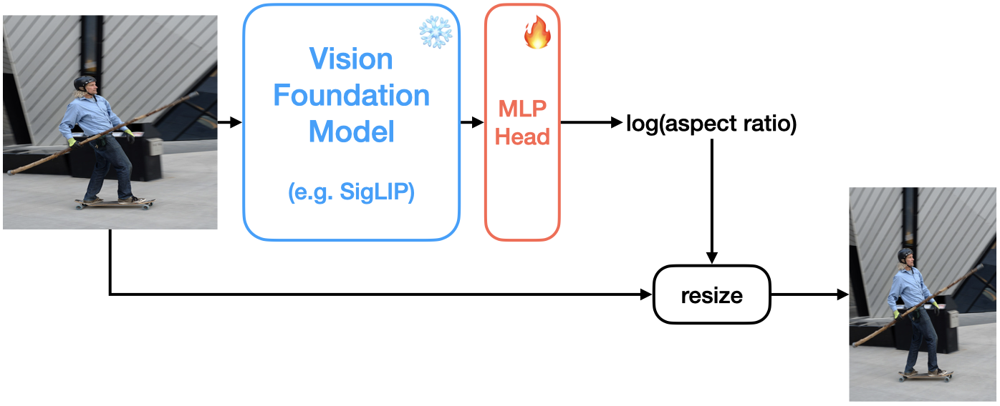

<h1 align="center">deresize</h1>
<p align="center">
  <b>Restores images to their natural aspect ratio.</b>
</p>


## Installation

```shell
pip install git+https://github.com/xyfJASON/deresize.git
```


## Quick Start

```python
import requests
from io import BytesIO
from PIL import Image
from deresize import Deresizer

# Let's download an example image and resize it improperly
response = requests.get("https://github.com/pytorch/vision/blob/main/gallery/assets/person1.jpg?raw=true")
image = Image.open(BytesIO(response.content)).resize((640, 640))
image.show()

# Instantiate the deresizer
deresizer = Deresizer("siglip", device="cuda")

# "De-resize" the image to its natural aspect ratio
image_deresized = deresizer(image)
image_deresized.show()
```


## How It Works

The input image is passed through a frozen Vision Foundation Model (e.g., SigLIP) to extract visual features.
These features are then fed into a lightweight, trainable MLP Head that predicts the log(aspect ratio),
which is used to resize the image back to its natural aspect ratio.

<p align="center">
  
</p>


## Model Zoo

Models will be automatically downloaded from Hugging Face when you instantiate `Deresizer`.

| Model Name |                                   Vision Foundation Model                                   |                             MLP Head                              |
|:----------:|:-------------------------------------------------------------------------------------------:|:-----------------------------------------------------------------:|
|   siglip   | [google/siglip-so400m-patch14-384](https://huggingface.co/google/siglip-so400m-patch14-384) | [siglip-head](https://huggingface.co/xyfJASON/deresize/tree/main) |
|    clip    |    [openai/clip-vit-large-patch14](https://huggingface.co/openai/clip-vit-large-patch14)    |  [clip-head](https://huggingface.co/xyfJASON/deresize/tree/main)  |
|    mae     |           [facebook/vit-mae-large](https://huggingface.co/facebook/vit-mae-large)           |  [mae-head](https://huggingface.co/xyfJASON/deresize/tree/main)   |


## Training

To train the model on your own dataset, use the following command:

```shell
cd training
torchrun --nproc-per-node 4 train.py --dataroot DATAROOT --model_name MODEL_NAME
```

- `DATAROOT`: Path to the image dataset.
- `MODEL_NAME`: Name of the model. Options: `siglip`, `clip`, `mae`.
